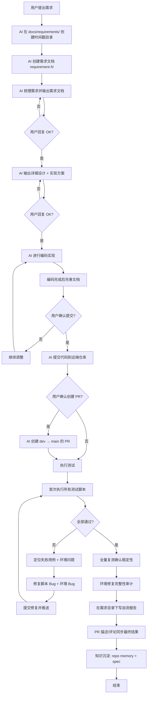

# Development Workflow

> **Definition of Done 流程图** — 从需求提出到代码合入 main 分支的完整流程规范。

---

## Workflow Overview



---

## 阶段详解

### 阶段 1: 需求文档 (Requirement)

**触发条件**: 用户提出新需求

**AI 操作**:
1. 在 `docs/requirements/` 下创建时间戳目录，格式: `YYYY-MM-DD`（如 `2026-07-23`）
2. 在时间戳目录中创建需求序号子目录，格式: `requirement-1`、`requirement-2`...
3. 复制 `docs/requirements/REQUIREMENT_TEMPLATE.md` 作为需求文档骨架
4. 基于用户描述填充需求文档，确保覆盖:
   - 需求背景与目标
   - 功能范围（In Scope / Out of Scope）
   - 功能详情与验收标准
   - 非功能性需求（性能、安全、兼容性）
   - 约束与假设
   - 风险评估
5. 将完整的需求文档呈现给用户评审

**退出条件**: 用户回复 **"ok"**（不区分大小写）确认需求无误

**目录结构示例**:
```
docs/requirements/
├── REQUIREMENT_TEMPLATE.md          # 需求文档模板
├── DESIGN_TEMPLATE.md               # 设计文档模板
├── 2026-07-23/
│   ├── requirement-1/
│   │   ├── requirement.md           # 需求文档
│   │   └── design.md                # 设计文档（阶段2产出）
│   └── requirement-2/
│       └── ...
```

---

### 阶段 2: 设计文档 (Design)

**触发条件**: 用户确认需求（回复 ok）

**AI 操作**:
1. 在同目录下创建 `design.md`
2. 基于 `docs/requirements/DESIGN_TEMPLATE.md` 填充设计文档，确保覆盖:
   - 技术方案选型与对比
   - 模块设计（新增/修改的文件结构）
   - 接口设计（函数签名、参数、返回值）
   - 数据流描述
   - 错误处理策略
   - 文件变更清单
   - 测试计划
   - 影响分析
3. 将完整的设计文档呈现给用户评审

**退出条件**: 用户回复 **"ok"**（不区分大小写）确认设计无误

---

### 阶段 3: 编码实现 (Implementation)

**触发条件**: 用户确认设计（回复 ok）

**AI 操作**:
1. 按照设计文档进行编码
2. 遵循 `.trellis/spec/script-dev/` 中的编码规范
3. 遵循 `.trellis/spec/guides/commit-mr-guidelines.md` 中的提交规范
4. 编码完成后**不立即提交**，先进入阶段 4

---

### 阶段 4: 文档完善 (Documentation)

**触发条件**: 编码实现完成

**AI 操作**:
1. 更新 `design.md`，补充实际实现中的变更（如有偏差）
2. 检查是否需要更新以下文档:
   - 项目 README（如有新增模块/工具）
   - `docs/` 下的用户指南/开发指南（如有流程变更）
   - `.trellis/spec/` 下的规范文件（如有新约定）
   - 需求文档中的验收标准勾选状态
3. 向用户汇报编码和文档完成情况

---

### 阶段 5: 代码提交 (Commit & Push)

**触发条件**: 文档完善完成

**AI 操作**:
1. 向用户确认: **"编码和文档已完成，是否提交代码到远端仓库？"**
2. 用户确认后:
   - 确保 commit message 符合 Conventional Commits 规范
   - 确保 commit message 仅使用 ASCII 英文（Gitea 限制）
   - `git add` 相关文件
   - `git commit` 提交
   - `git push` 推送到远端

---

### 阶段 6: 创建 PR (Pull Request)

**触发条件**: 代码推送成功

**AI 操作**:
1. 向用户确认: **"代码已推送到远端，是否需要创建 dev → main 的 PR？"**
2. 用户确认后:
   - 创建从当前分支到 `main` 的 PR
   - PR 标题使用 Conventional Commits 格式
   - PR 描述使用 ASCII 英文
   - 关联对应的需求文档链接

---

### 阶段 7: 执行测试 & 迭代修复 (Test & Fix Loop)

**触发条件**: 代码推送成功（及 PR 创建后）

**AI 操作**:
1. **首次全量执行**: 在目标测试环境中执行所有关联的测试脚本
2. **汇总结果**: 按通过/失败/错误分类，显示每个脚本的 phases 和耗时
3. **区分失败类型**:
   - **脚本 Bug**: 断言错误、label 不匹配、YAML 缺失字段等 → 修复 `.sh` 脚本
   - **环境 Bug**: CoreDNS CrashLoop、kubelet cert 缺失、CNI 配置错误等 → 修复 `create_k8s_env.py`
4. **修复后提交**: 每轮修复后 `git commit` + `git push`，commit message 描述具体修复内容
5. **循环复测**: 修复后重新执行失败用例，直到 100% 通过
6. **全量复测**: 失败用例全部修复后，执行一次完整的全量复测确认稳定性

**退出条件**: 全量复测 100% 通过，无失败无错误

**关键原则**:
- 每次修复后必须提交并推送，保持远端代码同步
- 先区分脚本 Bug 还是环境 Bug，再针对性修复
- 环境修复必须同时更新 `create_k8s_env.py`（确保新环境可重现）
- 全量复测使用带实时进度输出的脚本，方便观察执行进程

---

### 阶段 8: 环境修复完整性审计 (Environment Audit)

**触发条件**: 全量测试通过后

**AI 操作**:
1. 回顾整个调试过程中在目标环境上做的**所有手动修改**
2. 逐项对比 `create_k8s_env.py`（或等价的环境创建脚本），确认每项修复是否已固化
3. 输出审计表格，列出每项修复的：编号、描述、文件位置（行号）、状态
4. 给出明确结论：**"用脚本创建全新环境，是否可以确保功能正常？"**

**退出条件**: 所有环境修复均已固化到脚本中，新环境可完全自动化创建

**审计表格模板**:
```markdown
| # | 修复项 | 文件位置（行号） | 状态 |
|---|--------|-----------------|:---:|
| 1 | xxx 修复 | L123 | ✅ |
| 2 | yyy 修复 | L456 | ✅ |
```

---

### 阶段 9: 自测报告 & PR 同步 (Self-Test Report & PR Sync)

**触发条件**: 环境审计完成

**AI 操作**:
1. **写自测报告**: 在需求目录下创建/更新 `self-test-report.md`，包含：
   - 自测概览（环境、范围、总体结果）
   - 每次执行的详细结果（首次/修复后/最终全量）
   - 发现的问题与修复记录
   - 环境可重复性审计结论
   - 后续改进建议
2. **更新 PR 描述**: 使用 Gitea API 将最新结果同步到 PR 描述
3. **PR 评论**: 在 PR 中添加一条评论，包含 25 个脚本的完整结果表格
4. **清理临时文件**: 删除调试过程中产生的临时脚本和文件

**退出条件**: 自测报告已保存，PR 描述和评论已同步最终结果

**自测报告位置**: `docs/requirements/<日期>/<requirement-N>/self-test-report.md`

---

### 阶段 10: 知识沉淀 (Knowledge Capture)

**触发条件**: PR 同步完成

**AI 操作**:
1. 更新 **repo memory**: 在 `/memories/repo/` 下记录本次发现的关键修复和决策
2. 检查是否需要更新 `.trellis/spec/` 下的规范文件（如发现新的编码约定）
3. 检查是否需要更新本流程文档（如本次执行发现有流程缺失）
4. 提交所有知识沉淀的变更

**退出条件**: 所有知识沉淀已提交并推送

**沉淀内容示例**:
- Bug 根因分析（修复编号、症状、根因、修复方案）
- 已验证的环境配置
- 修改的关键文件及其变更说明
- Gitea API 使用模式（如 token、API 端点）

### 必须遵守

| 规则 | 说明 |
|------|------|
| **需求先行** | 必须先写需求文档并获得 ok，才能进入设计阶段 |
| **设计后编码** | 必须先写设计文档并获得 ok，才能开始编码 |
| **不跳步** | 每个阶段必须等待用户 ok 后才能进入下一阶段 |
| **文档同步** | 编码完成后必须完善文档，不能留 TODO |
| **两次确认** | 提交代码和创建 PR 都需要用户明确同意 |
| **自测报告约束** | 自测报告必须写在需求目录下（`docs/requirements/<日期>/<requirement-N>/self-test-report.md`），不得在 `docs/` 根目录单独存放 |
| **失败即修复** | 测试失败后必须定位根因（区分脚本 Bug vs 环境 Bug），修复后提交推送，循环直到 100% 通过 |
| **环境可重现** | 所有环境修复必须同步到环境创建脚本（如 `create_k8s_env.py`），确保新环境完全自动化可用 |
| **结果可追溯** | 最终测试结果必须同步到 PR（描述 + 评论），自测报告永久保存到需求目录 |
| **知识闭环** | 每次大需求完成后必须更新 repo memory 和 spec，避免重复踩坑 |

### 识别 "ok"

用户回复中的以下模式视为确认:
- `ok`、`OK`、`Ok`
- `没问题`、`可以`、`好的`
- `looks good`、`LGTM`

### 序号递增

- 同一天的需求按 `requirement-1`、`requirement-2`... 递增
- 不重名、不复用已存在的目录

---

## 与 Trellis 任务的关系

本工作流是**开发流程规范**，独立于 Trellis 的任务系统。当用户明确要求使用 Trellis 任务管理时:
- 需求文档 = Trellis 任务的 PRD
- 设计文档 = Trellis 任务的 research 输出
- 编码实现 = Trellis 任务的 implement 阶段

通常情况下，简单需求直接遵循本工作流即可，复杂多步骤需求可结合 Trellis 任务追踪。

---

## 快速参考

```
用户: "我想做一个XXX功能"

AI:  1. 创建 docs/requirements/2026-07-23/requirement-N/requirement.md
     2. 填充需求文档
     3. "请评审以上需求文档，回复 ok 进入设计阶段"

用户: "ok"

AI:  4. 创建 docs/requirements/2026-07-23/requirement-N/design.md
     5. 填充设计文档
     6. "请评审以上设计文档，回复 ok 进入编码阶段"

用户: "ok"

AI:  7. 按设计编码实现
     8. 完善文档（更新 design.md、README、spec 等）
     9. "编码和文档已完成，是否提交代码？"

用户: "提交"

AI:  10. git add/commit/push
     11. "代码已推送，是否创建 PR？"

用户: "创建"

AI:  12. 创建 dev → main PR
     13. 执行测试 → 失败则修复 → 提交推送 → 循环至 100% 通过
     14. 全量复测确认稳定性
     15. 环境修复审计（create_k8s_env.py 是否完整）
     16. 写自测报告 → 保存到需求目录
     17. 同步 PR 描述 + 评论最终测试结果
     18. 知识沉淀 → repo memory + spec 更新
     19. 清理临时文件 → 结束
```

用户: "ok"

AI:  7. 编码实现
     8. 完善文档
     9. "编码和文档已完成，是否提交代码到远端仓库？"

用户: "是"

AI:  10. git commit & push
     11. "代码已推送，是否需要创建 dev → main 的 PR？"

用户: "是" / "否"

AI:  12. 执行测试
     13. 在 docs/requirements/<日期>/<requirement-N>/self-test-report.md 写自测报告
     14. 更新 requirement.md / design.md 状态 + 链接
     15. "自测报告已写入需求目录"
```

---

**Language**: English (docs) / Chinese (discussion)
