# Trellis 开发工作流

> 源文件：`.trellis/workflow.md` | 更新于 2026-10-10

```mermaid
flowchart TD
    A["💬 用户请求"] --> B{请求类型}
    B -->|Issue 链接| IA["🔗 I-1 获取 Issue<br/>分析语言、分类"]
    B -->|简单对话 / 小任务| C["❓ 是否创建 Trellis 任务?"]
    B -->|复杂任务| D["❓ 是否创建任务并进入规划?"]

    %% Issue workflow
    IA --> IC{Bug 还是 Feature?}
    IC -->|Feature Request| F
    IC -->|Bug| BD["B-1 根因分析<br/>写 bug-analysis.md"]
    BD --> BE["B-2 提出修复方案<br/>展示给用户确认"]
    BE --> BF{用户确认修复?}
    BF -->|否 / 需修改| BD
    BF -->|是| BG["创建 fix-分支<br/>git checkout -b fix-issueid upstream/main"]
    BG --> BH["B-3 实现修复 & 验证"]
    BH --> BIPush["B-4 推送 fix 分支<br/>git push origin fix-issueid"]
    BIPush --> BICI["等待 CI 流水线"]
    BICI --> BICIP{CI 通过?}
    BICIP -->|是| BI["B-5 创建 Bug-fix PR<br/>Closes #issue + 自测报告"]
    BICIP -->|否| BICIF{失败原因?}
    BICIF -->|代码问题| BH
    BICIF -->|流水线/基础设施| BICIISSUE["创建 Issue<br/>停止，告知用户"]
    BI --> BJ["B-6 准备 Issue 回复<br/>用原语言起草回复"]
    BJ --> BK{用户确认回复?}
    BK -->|否 / 需修改| BJ
    BK -->|是| BL["发布回复到 Issue"]
    BL --> AH

    C -->|否| E["跳过 Trellis，直接处理"]
    C -->|是| F

    D -->|否| G["解释范围 / 建议拆分更小任务"]
    D -->|是| F

    F["📋 Phase 1: 规划"] --> H["1.0 创建任务<br/>task.py create"]
    H --> I["1.1 需求探索 + TDD<br/>需求点 & 测试点"]
    I --> J{需要研究?}
    J -->|是| K["1.2 调研<br/>trellis-research"]
    K --> I
    J -->|否| L{子代理平台?}
    L -->|是| M["1.3 配置上下文<br/>implement.jsonl / check.jsonl"]
    L -->|否| N
    M --> N["1.35 🔒 规划评审门<br/>需求点 + 测试点 + 测试用例"]
    N --> O{用户确认?}
    O -->|否 / 需要修改| I
    O -->|是| P["1.4 激活任务<br/>task.py start"]
    P --> Q["1.5 创建 feature 分支<br/>git checkout -b feat-slug upstream/main"]

    Q --> R["⚙️ Phase 2: 执行"]

    R --> S["2.1 实现<br/>trellis-implement"]
    S --> T["2.2 质量检查<br/>trellis-check"]
    T --> U{通过?}
    U -->|否| V{需要回滚?}
    V -->|是| W["2.3 回滚"]
    W --> S
    V -->|否| S
    U -->|是| X{还有更多?}
    X -->|是| S
    X -->|否| Y

    Y["✅ Phase 3: 完成"] --> Z{需要 Debug 回顾?}
    Z -->|是| AA["3.2 Debug 回顾<br/>trellis-break-loop"]
    AA --> AB
    Z -->|否| AB["3.3 更新 Spec<br/>trellis-update-spec"]
    AB --> AC["3.4 推送分支到 origin<br/>git push origin feat/fix"]
    AC --> CI["3.5 等待 CI 流水线<br/>检查 origin CI 状态"]
    CI --> CIP{CI 通过?}
    CIP -->|是| CR["3.6 创建 PR<br/>feat/fix → upstream/main<br/>(无 upstream 则 origin/main)"]
    CIP -->|否| CIF{失败原因?}
    CIF -->|代码问题| FIXLOOP["修复代码<br/>返回 2.1 实现"]
    FIXLOOP --> AC
    CIF -->|流水线/基础设施| CIISSUE["创建 Issue<br/>停止，告知用户"]
    CR --> AD["3.7 Squash 提交 & PR 评审<br/>压缩所有 commit 为 1 个"]
    AD --> AE{用户决定?}
    AE -->|合并| AF["🔀 合并 PR 到 upstream/main"]
    AE -->|不合并| AG["❌ 关闭 PR"]
    AF --> AH["3.8 收尾提醒<br/>提醒执行 /finish-work"]
    AG --> AH

    style F fill:#e1f5fe,stroke:#0288d1
    style R fill:#fff3e0,stroke:#f57c00
    style Y fill:#e8f5e9,stroke:#388e3c
    style N fill:#ffebee,stroke:#d32f2f
    style O fill:#ffebee,stroke:#d32f2f
    style AE fill:#ffebee,stroke:#d32f2f
    style IA fill:#f3e5f5,stroke:#7b1fa2
    style BD fill:#fce4ec,stroke:#c62828
    style BE fill:#ffebee,stroke:#d32f2f
    style BF fill:#ffebee,stroke:#d32f2f
    style BK fill:#ffebee,stroke:#d32f2f
    style CIP fill:#ffebee,stroke:#d32f2f
    style CIF fill:#ffebee,stroke:#d32f2f
    style BICIP fill:#ffebee,stroke:#d32f2f
    style BICIF fill:#ffebee,stroke:#d32f2f
```

## 阶段说明

| 阶段 | 状态 | 核心动作 |
|------|------|---------|
| **Issue 工作流** | — | 获取 Issue → 分类(Bug/Feature) → Bug: 根因分析→确认→修复→CI等待→PR→回复 |
| **Phase 1: 规划** | `planning` | 创建任务 → 需求探索(TDD) → 评审门(需求点+测试点) → 激活任务 → 建分支 |
| **Phase 2: 执行** | `in_progress` | 实现 → 质量检查 → 循环直到完成 |
| **Phase 3: 完成** | `in_progress` | Debug 回顾 → 更新 Spec → 推送 origin → **CI 等待** → 创建 PR(upstream/main 或 origin/main) → Squash → 用户合并 |

## 关键规则

1. 🔗 **Issue 工作流**：收到 issue 链接时，先分析语言和分类（Bug/Feature），不走标准需求流程
2. 🐛 **Bug 修复流程**：根因分析 → 提出方案 → 用户确认 → 修复 → `fix-<issue-id>` 分支 → CI 等待 → PR 引用 issue + 自测报告
3. ⚙️ **CI 流水线门**：push 到 origin 后必须等待 CI 完成。CI 失败 → 代码问题则修复后重推，流水线/基础设施问题则创建 issue 并停止
4. 🚫 **禁止修改流水线**：绝不能修改 CI 配置文件。流水线本身有问题 → 创建 issue 交给用户处理
5. 💬 **回复语言**：依 issue 原始语言（中文→中文，英文→英文），草稿需用户确认后再发布
6. 🔒 **1.35 评审门**：用户必须确认规划产物后才能 `task.py start`
7. 🌿 **分支策略**：Feature → `feat-<slug>`，Bug → `fix-<issue-id>`，均基于 `upstream/main`
8. 📤 **PR 工作流**：推送到 origin → CI 等待 → 创建 PR(upstream/main, 无 upstream 则 origin/main) → Squash → 用户决定合并
9. 🚫 **禁止自行合并**：AI 绝不能自行合并 PR
10. 🔑 **GitHub Token**：存本地环境变量，不提交仓库。无 token 时向用户索要，禁止自动化获取
11. 📝 **Commit/PR 格式**：全部英文，Conventional Commits: `type(scope): summary`
12. 🧪 **TDD 规划**：prd.md 必须包含需求点列表 + 测试用例计划(正向/负向/边界/异常)，测试先于实现
13. 🔗 **Git 远程 URL**：GitHub 偶有网络不稳定属正常现象，禁止因此修改 remote URL。用户配置的 SSH/HTTPS 是权威的，禁止切换协议或修改地址