# Development Workflow

```mermaid
flowchart TD
    A["💬 用户请求"] --> B{请求类型}
    B -->|Issue 链接| IA["🔗 I-1 获取 Issue<br/>分析语言、分类"]
    B -->|简单对话 / 小任务| C["❓ 创建 Trellis 任务?"]
    B -->|复杂任务| D["❓ 创建任务并进入规划?"]

    %% Issue workflow
    IA --> IC{Bug 还是 Feature?}
    IC -->|Feature Request| F
    IC -->|Bug| BD["B-1 根因分析<br/>写 bug-analysis.md"]
    BD --> BE["B-2 提出修复方案<br/>展示给用户确认"]
    BE --> BF{用户确认修复?}
    BF -->|否 / 需修改| BD
    BF -->|是| BG["创建 fix-分支<br/>git checkout -b fix-issueid upstream/main"]
    BG --> BH["B-3 实现修复 & 验证"]
    BH --> BIPush["B-4 推送 fix 分支<br/>git push origin fix-issueid"]
    BIPush --> BICI["等待 CI 流水线"]
    BICI --> BICIP{CI 通过?}
    BICIP -->|是| BI["B-5 创建 Bug-fix PR<br/>Closes #issue + 自测报告"]
    BICIP -->|否| BICIF{失败原因?}
    BICIF -->|代码问题| BH
    BICIF -->|流水线/基础设施| BICIISSUE["创建 Issue<br/>停止，告知用户"]
    BI --> BJ["B-6 准备 Issue 回复<br/>用原语言起草回复草稿"]
    BJ --> BK{用户确认回复?}
    BK -->|否 / 需修改| BJ
    BK -->|是| BL["发布回复到 Issue"]
    BL --> AH

    C -->|否| E["跳过 Trellis"]
    C -->|是| F

    D -->|否| G["解释范围 / 拆分更小任务"]
    D -->|是| F

    F["📋 Phase 1: 规划"] --> H["1.0 创建任务<br/>task.py create"]
    H --> I["1.1 需求探索 + TDD<br/>需求点 & 测试点"]
    I --> J{需要研究?}
    J -->|是| K["1.2 调研<br/>trellis-research"]
    K --> I
    J -->|否| L{子代理平台?}
    L -->|是| M["1.3 配置上下文<br/>implement.jsonl / check.jsonl"]
    L -->|否| N
    M --> N["1.35 🔒 规划评审门<br/>需求点 + 测试点 + 测试用例"]
    N --> O{用户确认?}
    O -->|否 / 需修改| I
    O -->|是| P["1.4 激活任务<br/>task.py start"]
    P --> Q["1.5 创建 feat 分支<br/>git checkout -b feat-slug upstream/main"]

    Q --> R["⚙️ Phase 2: 执行"]
    R --> S["2.1 实现<br/>trellis-implement"]
    S --> T["2.2 质量检查<br/>trellis-check"]
    T --> U{通过?}
    U -->|否| V{需要回滚?}
    V -->|是| W["2.3 回滚"]
    W --> S
    V -->|否| S
    U -->|是| X{还有更多?}
    X -->|是| S
    X -->|否| Y

    Y["✅ Phase 3: 完成"] --> Z{需要 Debug 回顾?}
    Z -->|是| AA["3.2 Debug 回顾<br/>trellis-break-loop"]
    AA --> AB
    Z -->|否| AB["3.3 更新 Spec<br/>trellis-update-spec"]
    AB --> AC["3.4 推送分支到 origin<br/>git push origin feat/fix"]
    AC --> CI["3.5 等待 CI 流水线<br/>检查 origin CI 状态"]
    CI --> CIP{CI 通过?}
    CIP -->|是| CR["3.6 创建 PR<br/>feat/fix → upstream/main<br/>(无 upstream 则 origin/main)"]
    CIP -->|否| CIF{失败原因?}
    CIF -->|代码问题| FIXLOOP["修复代码<br/>返回 2.1 实现"]
    FIXLOOP --> AC
    CIF -->|流水线/基础设施| CIISSUE["创建 Issue<br/>停止，告知用户"]
    CR --> AD["3.7 Squash & PR 评审<br/>压缩为 1 个 commit"]
    AD --> AE{用户决定?}
    AE -->|合并| AF["🔀 合并 PR"]
    AE -->|不合并| AG["❌ 关闭 PR"]
    AF --> AH["3.8 收尾<br/>提醒 /finish-work"]
    AG --> AH

    style F fill:#e1f5fe,stroke:#0288d1
    style R fill:#fff3e0,stroke:#f57c00
    style Y fill:#e8f5e9,stroke:#388e3c
    style N fill:#ffebee,stroke:#d32f2f
    style O fill:#ffebee,stroke:#d32f2f
    style AE fill:#ffebee,stroke:#d32f2f
    style IA fill:#f3e5f5,stroke:#7b1fa2
    style BD fill:#fce4ec,stroke:#c62828
    style BE fill:#ffebee,stroke:#d32f2f
    style BF fill:#ffebee,stroke:#d32f2f
    style BK fill:#ffebee,stroke:#d32f2f
    style CIP fill:#ffebee,stroke:#d32f2f
    style CIF fill:#ffebee,stroke:#d32f2f
    style BICIP fill:#ffebee,stroke:#d32f2f
    style BICIF fill:#ffebee,stroke:#d32f2f
```



---

## Core Principles

1. **Plan before code** — figure out what to do before you start
2. **Specs injected, not remembered** — guidelines are injected via hook/skill, not recalled from memory
3. **Persist everything** — research, decisions, and lessons all go to files; conversations get compacted, files don't
4. **Incremental development** — one task at a time
5. **Capture learnings** — after each task, review and write new knowledge back to spec

---

## Trellis System

### Developer Identity

On first use, initialize your identity:

```bash
python ./.trellis/scripts/init_developer.py <your-name>
```

Creates `.trellis/.developer` (gitignored) + `.trellis/workspace/<your-name>/`.

### Spec System

`.trellis/spec/` holds coding guidelines organized by package and layer.

- `.trellis/spec/<package>/<layer>/index.md` — entry point with **Pre-Development Checklist** + **Quality Check**. Actual guidelines live in the `.md` files it points to.
- `.trellis/spec/guides/index.md` — cross-package thinking guides.

```bash
python ./.trellis/scripts/get_context.py --mode packages   # list packages / layers
```

**When to update spec**: new pattern/convention found · bug-fix prevention to codify · new technical decision.

### Task System

Every task has its own directory under `.trellis/tasks/{MM-DD-name}/` holding `task.json`, `prd.md`, optional `design.md`, optional `implement.md`, optional `research/`, and context manifests (`implement.jsonl`, `check.jsonl`) for sub-agent-capable platforms.

```bash
# Task lifecycle
python ./.trellis/scripts/task.py create "<title>" [--slug <name>] [--parent <dir>]
python ./.trellis/scripts/task.py start <name>          # set active task (session-scoped when available)
python ./.trellis/scripts/task.py current --source      # show active task and source
python ./.trellis/scripts/task.py finish                # clear active task (triggers after_finish hooks)
python ./.trellis/scripts/task.py archive <name>        # move to archive/{year-month}/
python ./.trellis/scripts/task.py list [--mine] [--status <s>]
python ./.trellis/scripts/task.py list-archive

# Code-spec context (injected into implement/check agents via JSONL).
# `implement.jsonl` / `check.jsonl` are seeded (empty) on `task create` for sub-agent-capable
# platforms; the AI curates real spec + research entries during planning. `validate` fails
# and `start` refuses while a seeded manifest is still empty — sub-agents would run with
# zero spec context. Pass `start --allow-empty-context` when that is intentional.
python ./.trellis/scripts/task.py add-context <name> <action> <file> <reason>
python ./.trellis/scripts/task.py list-context <name> [action]
python ./.trellis/scripts/task.py validate <name>

# Task metadata
python ./.trellis/scripts/task.py set-branch <name> <branch>
python ./.trellis/scripts/task.py set-base-branch <name> <branch>    # PR target
python ./.trellis/scripts/task.py set-scope <name> <scope>

# Hierarchy (parent/child)
python ./.trellis/scripts/task.py add-subtask <parent> <child>
python ./.trellis/scripts/task.py remove-subtask <parent> <child>

# PR creation
python ./.trellis/scripts/task.py create-pr [name] [--dry-run]
```

> Run `python ./.trellis/scripts/task.py --help` to see the authoritative, up-to-date list.

**Current-task mechanism**: `task.py create` creates the task directory and (when session identity is available) auto-sets the per-session active-task pointer so the planning breadcrumb fires immediately. `task.py start` writes the same pointer (idempotent if already set) and flips `task.json.status` from `planning` to `in_progress`. State is stored under `.trellis/.runtime/sessions/`. If no context key is available from hook input, `TRELLIS_CONTEXT_ID`, or a platform-native session environment variable, there is no active task and `task.py start` fails with a session identity hint. `task.py finish` deletes the current session file (status unchanged). `task.py archive <task>` writes `status=completed`, moves the directory to `archive/`, and deletes any runtime session files that still point at the archived task.

### Workspace System

Records every AI session for cross-session tracking under `.trellis/workspace/<developer>/`.

- `journal-N.md` — session log. **Max 2000 lines per file**; a new `journal-(N+1).md` is auto-created when exceeded.
- `index.md` — personal index (total sessions, last active).

```bash
python ./.trellis/scripts/add_session.py --title "Title" --commit "hash" --summary "Summary"
```

### Context Script

```bash
python ./.trellis/scripts/get_context.py                            # full session runtime
python ./.trellis/scripts/get_context.py --mode packages            # available packages + spec layers
python ./.trellis/scripts/get_context.py --mode phase --step <X.Y>  # detailed guide for a workflow step
```

---

<!--
  WORKFLOW-STATE BREADCRUMB CONTRACT (read this before editing the tag blocks below)

  The [workflow-state:STATUS] blocks embedded in the ## Phase Index section
  below are the SINGLE source of truth for the per-turn `<workflow-state>`
  breadcrumb that every supported AI platform's UserPromptSubmit hook
  reads. inject-workflow-state.py (Python platforms) and
  inject-workflow-state.js (OpenCode plugin) only parse them — there is no
  fallback dict baked into the scripts after v0.5.0-rc.0.

  STATUS charset: [A-Za-z0-9_-]+. When the hook can't find a tag, it
  degrades to a generic "Refer to workflow.md for current step." line —
  intentionally visible so users notice and fix a broken workflow.md.

  INVARIANT (test/regression.test.ts):
    Every workflow-walkthrough step marked `[required · once]` must have a
    matching enforcement line in its phase's [workflow-state:*] block. The
    breadcrumb is the only per-turn channel; if a mandatory step isn't
    mentioned there, the AI silently skips it (Phase 1 planning gate
    skip and Phase 3.4 commit skip both manifested via this gap).

  TAG ↔ PHASE scoping:
    [workflow-state:no_task]      → no active task; before Phase 1
    [workflow-state:task_error]   → active task record is unreadable; repair it before continuing
    [workflow-state:planning]     → all of Phase 1 (status='planning')
    [workflow-state:planning-inline] → Codex inline variant of Phase 1
    [workflow-state:in_progress]  → Phase 2 + Phase 3.2-3.7
                                    (status stays 'in_progress' from
                                    task.py start until task.py archive)
    [workflow-state:in_progress-inline] → Codex inline variant of Phase 2/3
    [workflow-state:completed]    → currently DEAD: cmd_archive flips
                                    status and moves the dir in the same
                                    call, so the resolver loses the
                                    pointer (block kept for a future
                                    explicit in_progress→completed
                                    transition)

  Editing checklist:
    - When you change a [workflow-state:STATUS] block, also check the
      matching phase's `[required · once]` walkthrough steps for sync
    - Run `trellis update` after editing to push the new bodies to
      downstream user projects (block-level managed replacement)
    - Full runtime contract:
      .trellis/spec/cli/backend/workflow-state-contract.md
-->

## Phase Index

```
Phase 1: Plan    → classify, get task-creation consent, then write planning artifacts
Phase 2: Execute → implement only after task status is in_progress, on a feature branch
Phase 3: Finish  → verify, push, wait for CI, create PR, and wrap up
```

### Request Triage

When the user provides an **issue link** (GitHub issue URL), follow the [Issue Workflow](#issue-workflow) instead of the standard triage below.

- Simple conversation or small task: ask only whether this turn should create a Trellis task. If the user says no, skip Trellis for this session.
- Complex task: ask whether you may create a Trellis task and enter planning. If the user says no, do not do broad inline implementation; explain, clarify scope, or suggest a smaller split.
- User approval to create a task is not approval to start implementation. Planning still happens first.

### Planning Artifacts

- `prd.md` — requirements, constraints, and acceptance criteria. Do not put technical design or execution checklists here.
- `design.md` — technical design for complex tasks: boundaries, contracts, data flow, tradeoffs, compatibility, rollout / rollback shape.
- `implement.md` — execution plan for complex tasks: ordered checklist, validation commands, review gates, and rollback points.
- `implement.jsonl` / `check.jsonl` — spec and research manifests for sub-agent context. They do not replace `implement.md`.
- Lightweight tasks may be PRD-only. Complex tasks must have `prd.md`, `design.md`, and `implement.md` before `task.py start`.

### Issue Workflow

When the user provides a GitHub issue link, follow this workflow instead of the standard feature flow. The key difference: issues must be classified as bug or feature request first.

#### I-1. Fetch and analyze the issue `[required · once]`

1. **Open the issue URL** in a browser or use `gh issue view <url>` to read the full issue content
2. **Determine the language** of the issue: note whether it's written in Chinese or English (will be used for the reply later)
3. **Classify the issue** as one of:
   - **Bug** — unexpected behavior, crash, incorrect output, regression → go to [Bug Fix Flow](#bug-fix-flow)
   - **Feature request** — new capability, enhancement, improvement → go to [Standard Feature Flow](#standard-feature-flow-from-issue)

If unclear, present your analysis and ask the user to confirm the classification.

---

### Bug Fix Flow

#### B-1. Root cause analysis `[required · once]`

Before any code changes, analyze the issue thoroughly:

1. **Reproduce** if possible — understand the exact conditions that trigger the bug
2. **Identify** the root cause with file:line anchors where applicable
3. **Write analysis** to `{TASK_DIR}/bug-analysis.md` (使用中文编写) with:
   - Issue link and summary
   - Root cause (what code path, what went wrong)
   - Impact scope (what else could be affected)

#### B-2. Propose fix and get confirmation `[required · once]`

1. Present a concise summary to the user:
   ```
   ## Bug Analysis
   Issue: <link>
   Root cause: <explanation with file:line>
   
   ## Proposed Fix
   - <change 1>
   - <change 2>
   
   Reply 'OK' / '可以' to proceed. Reply with edits or '不行' to revise.
   ```

2. **Wait for user confirmation** before writing any code. If the user rejects, revise and re-propose.
3. After confirmation, create the task and branch:
   ```bash
   python ./.trellis/scripts/task.py create "fix: <brief description>" --slug fix-<issue-id>
   python ./.trellis/scripts/task.py start fix-<issue-id>
   git fetch upstream main
   git checkout -b fix-<issue-id> upstream/main
   ```
4. Proceed to implement the fix (skip Phase 1 planning — bug analysis replaces it).

#### B-3. Implement and verify `[required · repeatable]`

1. Implement the fix on the `fix-<issue-id>` branch
2. Run quality checks (lint, type-check, tests)
3. Verify the original issue is resolved

#### B-4. Push and wait for CI `[required · once]`

1. **Push the fix branch to origin**:
   ```bash
   git push origin fix-<issue-id>
   ```

2. **Wait for CI pipeline** — follow the same [3.5 CI Pipeline Check](#35-ci-pipeline-check-required--once) process:
   - Monitor the origin CI pipeline until it completes
   - If CI passes: proceed to B-5 (create PR)
   - If CI fails due to code issues: fix, commit, push again; return to B-3
   - If CI fails due to pipeline/infrastructure issues: create an issue, inform the user, and **stop** — do NOT create a PR

#### B-5. Create bug-fix PR `[required · once]`

Only after CI passes:

1. Create PR:
   ```bash
   gh pr create --base main --head fix-<issue-id> --title "fix: <description>" --body "..."
   ```
2. PR description MUST include:
   - **Issue reference**: `Closes #<issue-id>`
   - **Root cause**: brief explanation
   - **Changes**: what was modified (files/packages)
   - **Test results**: how verified, test output summary
3. Squash to 1 commit, present PR for user merge decision.

#### B-6. Prepare issue reply `[required · once]`

Before replying on the issue thread, prepare the reply:

1. Draft the reply in the **same language** as the original issue (Chinese → 中文, English → English)
2. Format:
   ```
   ## Root Cause
   <brief explanation>
   
   ## Fix
   <what was changed, with file references>
   
   ## Verification
   <how it was tested, with results>
   ```
3. **Present the draft to the user** and ask:
   ```
   Proposed reply for <issue link>:
   
   <draft>
   
   Reply 'OK' / '可以' to post, or provide edits.
   ```
4. **Wait for user confirmation** before posting. Do NOT reply on the issue yourself.

---

### Standard Feature Flow (from issue)

When the issue is a feature request, follow the standard [Phase 1-3](#phase-1-plan) flow with these adjustments:

1. **Task title**: prefix with `feat:` and include the issue ID, e.g. `feat: add dark mode (#42)`
2. **PR description**: include `Closes #<issue-id>` to link the PR to the issue
3. **Issue reply** (B-6): after the PR is ready, prepare a reply in the issue's language summarizing what was implemented. Present draft to user for confirmation before posting.

### Branch Workflow

Every new task or feature MUST be developed on its own feature branch. Bug fixes use `fix-<issue-id>`; feature work uses `feat-<slug>`.

1. **After `task.py start`** (step 1.4) or after bug analysis confirmation:
   ```bash
   git fetch upstream main
   git checkout -b feat-<slug> upstream/main    # feature
   git checkout -b fix-<issue-id> upstream/main  # bug fix
   ```

2. All implementation and testing happens on this branch. Commit freely during development.

3. When development and testing are complete (Phase 3):
   - Push the feature/fix branch to origin
   - Create a Pull Request from `origin/feat-<slug>` (or `origin/fix-<issue-id>`) to `upstream/main` (fallback: `origin/main` if no `upstream` remote exists)
   - **Feature PR**: description MUST include changes scope, content summary, and test results
   - **Bug-fix PR**: description MUST reference the issue (e.g. `Closes #123`), include root cause analysis, fix description, and test results
   - All commit messages and PR titles/descriptions MUST be written in English, following the [Conventional Commits](#commit-and-pr-format) format
   - Squash all commits on the branch into a single commit
   - Wait for the user to decide whether to merge

4. Do NOT merge the PR yourself — the user makes the final merge decision.

### Parent / Child Task Trees

Use a parent task when one user request contains several independently verifiable deliverables. The parent task owns the source requirement set, the task map, cross-child acceptance criteria, and final integration review; it normally should not be the implementation target unless it also has direct work.

Use child tasks for deliverables that can be planned, implemented, checked, and archived independently. Parent/child structure is not a dependency system: if one child must wait for another, write that ordering in the child `prd.md` / `implement.md` and keep each child's acceptance criteria testable.

Create new children with `task.py create "<title>" --slug <name> --parent <parent-dir>`. Link existing tasks with `task.py add-subtask <parent> <child>`, and unlink mistakes with `task.py remove-subtask <parent> <child>`.

<!-- Per-turn breadcrumb: shown when there is no active task (before Phase 1) -->

[workflow-state:no_task]
No active task. First classify the current turn and ask for task-creation consent before creating any Trellis task.
Simple conversation / small task: ask only whether this turn should create a Trellis task. If the user says no, skip Trellis for this session.
Complex task: ask the user if you can create a Trellis task and enter the planning phase. If the user says no, explain, clarify scope, or suggest a smaller split.
[/workflow-state:no_task]

<!-- Per-turn breadcrumb: shown when the active task record cannot be read. -->

[workflow-state:task_error]
The active task record could not be read. Do not create or activate another task.
Inspect the task directory named above and repair its task.json. It must be a valid JSON object with a non-empty status.
Preserve existing task fields and artifacts. If the correct status cannot be determined safely, ask the user before reconstructing the record.
[/workflow-state:task_error]

### Phase 1: Plan
- 1.0 Create task `[required · once]` (only after task-creation consent)
- 1.1 Requirement exploration `[required · repeatable]` (`prd.md`; complex tasks also need `design.md` + `implement.md`)
- 1.2 Research `[optional · repeatable]`
- 1.3 Configure context `[required · once]` — Claude Code, Cursor, OpenCode, Codex, Kiro, Gemini, Qoder, CodeBuddy, Copilot, Droid, Pi, Oh My Pi, ZCode, Snow, Reasonix, Grok, Kimi Code (sub-agent-dispatch platforms only; inline platforms skip)
- 1.35 Planning review gate `[required · once]` — present final planning summary, ask user to confirm before proceeding; if not OK, return to 1.1
- 1.4 Activate task `[required · once]` (only after user confirms planning; `task.py start`; status → in_progress)
- 1.5 Create feature branch `[required · once]` (after start, create `feat-<slug>` from `upstream/main`)
- 1.6 Completion criteria

<!-- Per-turn breadcrumb: shown throughout Phase 1 (status='planning') -->

[workflow-state:planning]
Load `trellis-brainstorm`; stay in planning.
Lightweight: `prd.md` can be enough. Complex: finish `prd.md`, `design.md`, and `implement.md`.
Multi-deliverable scope: consider a parent task plus independently verifiable child tasks; dependencies must be written in child artifacts, not implied by tree position.
Sub-agent mode: curate `implement.jsonl` and `check.jsonl` as spec/research manifests.
**文档语言**: `prd.md`、`design.md`、`implement.md` 必须使用中文编写。
**TDD**: `prd.md` MUST include numbered requirements (R1, R2...) and a test case plan (positive, negative, edge-case, boundary) mapped to each requirement.
**Review gate (step 1.35)**: Before `task.py start`, present final planning summary with requirements + test points and ask user to confirm. If user says NOT OK, return to 1.1 to revise. DO NOT proceed to 1.4 without explicit user approval.
[/workflow-state:planning]

<!-- Per-turn breadcrumb: shown throughout Phase 1 when codex.dispatch_mode=inline.
     Codex-only opt-in alternate to [workflow-state:planning]. The main agent
     edits code directly in Phase 2, so jsonl curation is skipped —
     the inline workflow loads `trellis-before-dev` instead of injecting JSONL
     into a sub-agent. -->

[workflow-state:planning-inline]
Load `trellis-brainstorm`; stay in planning.
Lightweight: `prd.md` can be enough. Complex: finish `prd.md`, `design.md`, and `implement.md`.
Multi-deliverable scope: consider a parent task plus independently verifiable child tasks; dependencies must be written in child artifacts, not implied by tree position.
Inline mode: skip jsonl curation; Phase 2 reads artifacts/specs via `trellis-before-dev`.
**文档语言**: `prd.md`、`design.md`、`implement.md` 必须使用中文编写。
**TDD**: `prd.md` MUST include numbered requirements (R1, R2...) and a test case plan (positive, negative, edge-case, boundary) mapped to each requirement.
**Review gate (step 1.35)**: Before `task.py start`, present final planning summary with requirements + test points and ask user to confirm. If user says NOT OK, return to 1.1 to revise. DO NOT proceed to 1.4 without explicit user approval.
[/workflow-state:planning-inline]

### Phase 2: Execute
- 2.1 Implement `[required · repeatable]`
- 2.2 Quality check `[required · repeatable]`
- 2.3 Rollback `[on demand]`

<!-- Per-turn breadcrumb: shown while status='in_progress'.
     Scope: all of Phase 2 + Phase 3.2-3.7 (status stays 'in_progress' from
     task.py start until task.py archive; only archive flips it). The body
     therefore must cover every required step from implementation through
     commit, including Phase 3.3 spec update, Phase 3.4 push, Phase 3.5 CI wait, and Phase 3.6 PR creation. -->

Sub-agent dispatch protocol applies to all platforms and all sub-agents, including native Codex `SubagentStart` context injection with child-side pull fallback, class-2 Gemini/Qoder/Copilot/Reasonix/Trae/Grok/Kimi Code, hook-backed ZCode/Snow, and `trellis-research`: every dispatch prompt starts with `Active task: <task path from task.py current>` before role-specific instructions. On Grok Build, use `spawn_subagent` with `subagent_type` set to the Trellis agent name (e.g. `trellis-implement`). On Kimi Code, dispatch the built-in `coder` / `explore` sub-agent with the matching `.kimi-code/skills/trellis-<role>/SKILL.md` instructions.

[workflow-state:in_progress]
Tools: `trellis-implement` / `trellis-research` are sub-agent types only (Task/Agent tool, NOT Skill; there is no skill by these names). `trellis-update-spec` is a skill. `trellis-check` exists as both; prefer the Agent form when verifying after code changes.
Flow: `trellis-implement` -> `trellis-check` -> `trellis-update-spec` -> push to origin (Phase 3.4) -> wait for CI (Phase 3.5) -> create PR (Phase 3.6) -> squash commits (Phase 3.7) -> `/trellis:finish-work`.
**Branch**: All work happens on `feat-<slug>` branch from `upstream/main`. Push to origin, create PR to upstream/main (or origin/main if no upstream remote) with changes summary + test results.
**文档语言**: `prd.md`、`design.md`、`implement.md`、`bug-analysis.md` 使用中文；commit 和 PR 使用英文。
**Commits & PR**: ALL messages in English, Conventional Commits format (`type(scope): summary`). See Guardrails for rules.
Main-session default: dispatch implement/check sub-agents. Sub-agent self-exemption: if already running as `trellis-implement`, do NOT spawn another `trellis-implement` or `trellis-check`; if already running as `trellis-check`, do NOT spawn another `trellis-check` or `trellis-implement`. Dispatch is main session only.
Dispatch prompt starts with `Active task: <task path from task.py current>`. Read context: jsonl entries -> `prd.md` -> `design.md if present` -> `implement.md if present`.
[/workflow-state:in_progress]

<!-- Per-turn breadcrumb: shown while status='in_progress' when
     codex.dispatch_mode=inline. Codex-only opt-in alternate to
     [workflow-state:in_progress]. The main session edits code directly
     instead of dispatching sub-agents. -->

[workflow-state:in_progress-inline]
Flow: `trellis-before-dev` -> edit -> `trellis-check` -> validation -> `trellis-update-spec` -> push to origin (Phase 3.4) -> wait for CI (Phase 3.5) -> create PR (Phase 3.6) -> squash commits (Phase 3.7) -> `/trellis:finish-work`.
**Branch**: All work happens on `feat-<slug>` branch from `upstream/main`. Push to origin, create PR to upstream/main (or origin/main if no upstream remote) with changes summary + test results.
**文档语言**: `prd.md`、`design.md`、`implement.md`、`bug-analysis.md` 使用中文；commit 和 PR 使用英文。
**Commits & PR**: ALL messages in English, Conventional Commits format (`type(scope): summary`). See Guardrails for rules.
Do not dispatch implement/check sub-agents in inline mode.
Read context: `prd.md` -> `design.md if present` -> `implement.md if present`, plus relevant spec/research loaded by skills.
[/workflow-state:in_progress-inline]

### Phase 3: Finish
- 3.2 Debug retrospective `[on demand]`
- 3.3 Spec update `[required · once]`
- 3.4 Push branch to origin `[required · once]` (push `feat-<slug>` or `fix-<issue-id>` to origin)
- 3.5 CI pipeline check `[required · once]` (wait for origin CI to pass; if code issue → fix → re-push; if pipeline/infra issue → create issue → stop)
- 3.6 Create PR `[required · once]` (create PR to `upstream/main`, or `origin/main` if no upstream remote; only after CI passes)
- 3.7 Squash commits and PR review `[required · once]` (squash all commits into one, present PR for user merge decision)
- 3.8 Wrap-up reminder

> Note: step 3.1 was folded into 2.2 (last-iteration full-scope check). Numbering kept stable to avoid breaking external references.

<!-- Per-turn breadcrumb: shown while status='completed'.
     Currently DEAD in normal flow: cmd_archive writes status='completed' in
     the same call that moves the task dir to archive/, so the active-task
     resolver loses the pointer and the hook never fires on archived tasks.
     Block preserved for a future status-transition redesign (e.g. an
     explicit in_progress→completed command). Edit through the same spec
     channel as the live blocks. -->

[workflow-state:completed]
Code committed. Run `/trellis:finish-work`; if dirty, return to Phase 3.4 first.
[/workflow-state:completed]

### Rules

1. Identify which Phase you're in, then continue from the next step there
2. Run steps in order inside each Phase; `[required]` steps can't be skipped
3. Phases can roll back (e.g., Execute reveals a prd defect → return to Plan to fix, then re-enter Execute)
4. Steps tagged `[once]` are skipped if the output already exists; don't re-run
5. Artifact presence informs the next step; missing `design.md` / `implement.md` is valid for lightweight tasks and incomplete planning for complex tasks.

### Active Task Routing

When a user request matches one of these intents inside an active task, route first, then load the detailed phase step if needed.

[Claude Code, Cursor, OpenCode, codex-sub-agent, Kiro, Gemini, Qoder, CodeBuddy, Copilot, Droid, Pi, Oh My Pi, ZCode, Snow, Reasonix, Trae, Grok, Kimi Code]

- Planning or unclear requirements -> `trellis-brainstorm`.
- `in_progress` implementation/check -> dispatch `trellis-implement` / `trellis-check`.
- Repeated debugging -> `trellis-break-loop`; spec updates -> `trellis-update-spec`.

[/Claude Code, Cursor, OpenCode, codex-sub-agent, Kiro, Gemini, Qoder, CodeBuddy, Copilot, Droid, Pi, Oh My Pi, ZCode, Snow, Reasonix, Trae, Grok, Kimi Code]

[codex-inline, Kilo, Antigravity, Devin, DeepSeek Harness]

- Planning or unclear requirements -> `trellis-brainstorm`.
- Before editing -> `trellis-before-dev`; after editing -> `trellis-check`.
- Repeated debugging -> `trellis-break-loop`; spec updates -> `trellis-update-spec`.

[/codex-inline, Kilo, Antigravity, Devin, DeepSeek Harness]

### Guardrails

- Task creation approval is not implementation approval; implementation waits for `task.py start` after artifact review.
- **Planning review gate (step 1.35)**: user MUST confirm planning artifacts are correct before `task.py start`. If not OK, return to step 1.1.
- PRD-only is valid for lightweight tasks; complex tasks need `design.md` + `implement.md`.
- Planning must be persisted to task artifacts; checks must run before reporting completion.
- **Feature branch**: every task MUST be developed on a `feat-<slug>` branch from `upstream/main`.
- **Bug-fix branch**: bug fixes from issues MUST be developed on a `fix-<issue-id>` branch from `upstream/main`.
- **PR workflow**: push to origin, create PR to upstream/main (fallback: origin/main if no upstream remote), with changes + test results, squash to 1 commit, user decides merge.
- **Bug-fix PR**: MUST reference the issue (`Closes #<id>`), include root cause analysis and self-test report.
- **Issue reply**: MUST prepare draft in the issue's original language (Chinese → 中文, English → English), present to user for confirmation before posting.
- **CI pipeline gate**: after pushing to origin, MUST wait for CI to complete before creating a PR. CI failure → fix code (not pipeline) → push again. Pipeline/infra failure → create issue → stop and tell user.
- DO NOT modify CI pipeline files under any circumstances. If the pipeline itself is broken, create an issue and let the user handle it.
- DO NOT merge PRs yourself — the user makes the final merge decision.
- **Bug analysis before code**: for bug fixes, present root cause + proposed fix to the user and get confirmation before writing any code.
- **GitHub Token**: the GitHub token MUST be stored in a local environment variable (e.g. `GITHUB_TOKEN` or `GH_TOKEN`) and NEVER committed to the repository. Add token files to `.gitignore`. On first use, check if the token is available (`gh auth status`). If no token is found, ASK THE USER to provide one — do NOT attempt to obtain it through the browser, web login, or any other automated means.
- **Commit and PR format**: ALL commit messages and PR titles/descriptions MUST be written in English, following Conventional Commits: `<type>(<scope>): <summary>` where type is one of feat|fix|docs|style|refactor|perf|test|chore|ci|build. Summary ≤ 100 chars, lowercase, no trailing period, ASCII only. See `.github/scripts/commit-lint.sh` for enforcement rules.
- **Documentation language**: ALL planning documents (`prd.md`, `design.md`, `implement.md`) and `bug-analysis.md` MUST be written in 中文 (Chinese). Commit messages and PR titles/descriptions remain in English per the rule above.
- **TDD planning**: during Phase 1.1 (brainstorm), the `prd.md` MUST explicitly list (a) **Requirements** — each requirement as a testable item, and (b) **Test Points** — specific test cases mapped to each requirement. Follow TDD principles: write test cases BEFORE implementation. Maximize test coverage: include positive, negative, edge-case, and boundary tests for every requirement. In step 1.35 (review gate), present both the requirements list AND the test case plan for user confirmation.
- **Git remote URL**: GitHub may occasionally have network instability — this is normal. NEVER modify `git remote` URLs to work around network issues. The user configured the remotes (`origin`, `upstream`) with specific URLs (SSH or HTTPS) for a reason. If a push/pull fails due to network timeout or SSH issues, simply retry or wait — do NOT switch between SSH and HTTPS, do NOT change remote URLs, do NOT add new remotes. The user's configuration is authoritative.

### Commit and PR Format

ALL commit messages and PR titles/descriptions MUST follow these rules:

**Format**: `<type>(<scope>): <summary>` (Conventional Commits)

**Allowed types**: `feat` | `fix` | `docs` | `style` | `refactor` | `perf` | `test` | `chore` | `ci` | `build`

**Rules**:
- Summary in English only (ASCII), ≤ 100 characters
- Lowercase first character, no trailing period
- PR title: `feat(<scope>): <summary>` or `fix(<scope>): <summary>`
- PR description: structured with ## Summary, ## Changes, ## Test Results
- Bug-fix PRs: add `Closes #<id>` in description plus ## Root Cause and ## Verification

**Examples**:
- ✅ `feat(ci): add pool create --count flag`
- ✅ `fix(http): propagate timeout to client`
- ❌ `feat: release deletes and recreates CloudPods VM to ensure no residual state` (too long)
- ❌ `feat: 添加日志功能` (non-English)

See `.github/scripts/commit-lint.sh` for enforcement rules.

### GitHub Token Setup

The GitHub token is required for `gh` CLI operations (PR creation, issue fetching). Setup rules:

1. **Token MUST be stored locally** as environment variable (`GITHUB_TOKEN` or `GH_TOKEN`) — NEVER in repo files
2. **Verify token on first use**: run `gh auth status` to check if authenticated
3. **If no token found**: ASK THE USER to provide one. Example prompt:
   ```
   GitHub CLI is not authenticated. Please provide your token:
   Option A: Run `gh auth login` to login interactively
   Option B: Set env var: `$env:GITHUB_TOKEN = "ghp_..."` (PowerShell)
   ```
4. **NEVER** attempt to obtain the token through browser automation, web login, or any automated means — tokens are user secrets
5. Add token files (`.env`, `.token`, `*.token`) to `.gitignore`

### Loading Step Detail

At each step, run this to fetch detailed guidance:

```bash
python ./.trellis/scripts/get_context.py --mode phase --step <step>
# e.g. python ./.trellis/scripts/get_context.py --mode phase --step 1.1
```

---

## Phase 1: Plan

Goal: classify the request, get task-creation consent when a task is needed, and produce the planning artifacts required before implementation.

#### 1.0 Create task `[required · once]`

Create the task directory only after task-creation consent. The command sets status to `planning`, writes `task.json`, creates a default `prd.md`, and auto-targets the new task when session identity is available:

```bash
python ./.trellis/scripts/task.py create "<task title>" --slug <name>
```

`--slug` is the human-readable name only. Do **not** include the `MM-DD-` date prefix; `task.py create` adds that prefix automatically.

For task trees, create the parent task first and then create each child with `--parent <parent-dir>`. Do not start the parent just because children exist; start the child that owns the next independently verifiable deliverable.

After this command succeeds, the per-turn breadcrumb auto-switches to `[workflow-state:planning]`, telling the AI to stay in planning.

Run only `create` here — do not also run `start`. `start` flips status to `in_progress`, which switches the breadcrumb to the implementation phase before planning artifacts are reviewed. Save `start` for step 1.4.

Skip when `python ./.trellis/scripts/task.py current --source` already points to a task.

#### 1.1 Requirement exploration `[required · repeatable]`

Load the `trellis-brainstorm` skill and explore requirements interactively with the user per the skill's guidance.

The brainstorm skill will guide you to:
- Ask one question at a time
- Prefer researching over asking the user
- Prefer offering options over open-ended questions
- Update `prd.md` immediately after each user answer
- Split large scopes into a parent task plus child tasks when the deliverables can be verified independently
- Keep `prd.md` focused on requirements and acceptance criteria
- For complex tasks, produce `design.md` and `implement.md` before implementation starts

**TDD requirement**: When writing `prd.md`, you MUST include:

1. **Requirements section** — each requirement as a numbered testable item (e.g. "R1: The system shall..." "R2: When input is...")
2. **Test points section** — specific test cases mapped to each requirement:
   - **Positive tests**: verify correct behavior with valid inputs
   - **Negative tests**: verify proper error handling with invalid inputs
   - **Edge-case tests**: verify behavior at boundaries (empty, null, max values, etc.)
   - **Boundary tests**: verify behavior at known threshold values

Follow TDD principles strictly: write test cases BEFORE implementation code. Tests must cover every requirement — if a requirement has no corresponding test, it is not fully specified.

When considering a parent/child split:
- Use a parent task when one request contains several independently verifiable deliverables.
- Parent tasks own source requirements, child-task mapping, cross-child acceptance criteria, and final integration review.
- Child tasks own actual deliverables that can be planned, implemented, checked, and archived independently.
- Parent/child structure is not a dependency system. If child B depends on child A, write that ordering in child B's `prd.md` / `implement.md`.
- Start the child task that owns the next deliverable. Do not start the parent unless the parent itself has direct implementation work.

Return to this step whenever requirements change and revise the relevant artifact.

#### 1.2 Research `[optional · repeatable]`

Research can happen at any time during requirement exploration. It isn't limited to local code — you can use any available tool (MCP servers, skills, web search, etc.) to look up external information, including third-party library docs, industry practices, API references, etc.

[Claude Code, Cursor, OpenCode, codex-sub-agent, Kiro, Gemini, Qoder, CodeBuddy, Copilot, Droid, Pi, Oh My Pi, ZCode, Snow, Reasonix, Trae, Grok, Kimi Code]

Spawn the research sub-agent:

- **Agent type**: `trellis-research`
- **Task description**: Research <specific question>
- **Key requirement**: Research output MUST be persisted to `{TASK_DIR}/research/`

[/Claude Code, Cursor, OpenCode, codex-sub-agent, Kiro, Gemini, Qoder, CodeBuddy, Copilot, Droid, Pi, Oh My Pi, ZCode, Snow, Reasonix, Trae, Grok, Kimi Code]

[codex-inline, Kilo, Antigravity, Devin, DeepSeek Harness]

Do the research in the main session directly and write findings into `{TASK_DIR}/research/`. `codex-inline` is the explicit mode that keeps work in the main session.

[/codex-inline, Kilo, Antigravity, Devin, DeepSeek Harness]

**Research artifact conventions**:
- One file per research topic (e.g. `research/auth-library-comparison.md`)
- Record third-party library usage examples, API references, version constraints in files
- Note relevant spec file paths you discovered for later reference

Brainstorm and research can interleave freely — pause to research a technical question, then return to talk with the user.

**Key principle**: Research output must be written to files, not left only in the chat. Conversations get compacted; files don't.

#### 1.3 Configure context `[required · once]`

[Claude Code, Cursor, OpenCode, codex-sub-agent, Kiro, Gemini, Qoder, CodeBuddy, Copilot, Droid, Pi, Oh My Pi, ZCode, Snow, Reasonix, Trae, Grok, Kimi Code]

Curate `implement.jsonl` and `check.jsonl` so the Phase 2 sub-agents get the right spec/research context. These files were seeded on `task create` with a single self-describing `_example` line; your job here is to fill in real entries.

**Location**: `{TASK_DIR}/implement.jsonl` and `{TASK_DIR}/check.jsonl` (already exist).

**Format**: one JSON object per line — `{"file": "<path>", "reason": "<why>"}`. Paths are repo-root relative.

**What to put in**:
- **Spec files** — `.trellis/spec/<package>/<layer>/index.md` and any specific guideline files (`error-handling.md`, `conventions.md`, etc.) relevant to this task
- **Research files** — `{TASK_DIR}/research/*.md` that the sub-agent will need to consult

**What NOT to put in**:
- Code files (`src/**`, `packages/**/*.ts`, etc.) — those are read by the sub-agent during implementation, not pre-registered here
- Files you're about to modify — same reason

**Split between the two files**:
- `implement.jsonl` → specs + research the implement sub-agent needs to write code correctly
- `check.jsonl` → specs for the check sub-agent (quality guidelines, check conventions, same research if needed)

These manifests do not replace `implement.md`. `implement.md` is the human-readable execution plan for a complex task; jsonl files only list context files to inject or load.

**How to discover relevant specs**:

```bash
python ./.trellis/scripts/get_context.py --mode packages
```

Lists every package + its spec layers with paths. Pick the entries that match this task's domain.

**How to append entries**:

Either edit the jsonl file directly in your editor, or use:

```bash
python ./.trellis/scripts/task.py add-context "$TASK_DIR" implement "<path>" "<reason>"
python ./.trellis/scripts/task.py add-context "$TASK_DIR" check "<path>" "<reason>"
```

Delete the seed `_example` line once real entries exist (optional — it's skipped automatically by consumers).

Ready gate: both `implement.jsonl` and `check.jsonl` must contain at least one real `{"file": "...", "reason": "..."}` entry before `task.py start`. The seed `_example` row alone is not ready.

Skip this step only when both files already have real curated entries.

[/Claude Code, Cursor, OpenCode, codex-sub-agent, Kiro, Gemini, Qoder, CodeBuddy, Copilot, Droid, Pi, Oh My Pi, ZCode, Snow, Reasonix, Trae, Grok, Kimi Code]

[codex-inline, Kilo, Antigravity, Devin, DeepSeek Harness]

Skip this step. Context is loaded directly by the `trellis-before-dev` skill in Phase 2.

[/codex-inline, Kilo, Antigravity, Devin, DeepSeek Harness]

#### 1.35 Planning review gate `[required · once]`

**Before proceeding to `task.py start`, the user MUST explicitly confirm that the planning artifacts are correct.**

1. Present the final planning summary with:
   - Goal and scope summary
   - **Requirements** — each requirement as a testable item
   - **Test points** — specific test cases mapped to each requirement (positive, negative, edge-case, boundary)
   - Acceptance criteria
   - Artifact status (which files exist)
   - Any open risks or deferred items

2. Ask the user: **"Does this plan look correct? Reply OK to proceed to implementation, or tell me what needs to change."**

3. **If user says OK / approves**: proceed to step 1.4.

4. **If user says NOT OK / requests changes**: return to step 1.1, revise the relevant artifacts (`prd.md`, `design.md`, `implement.md`) based on user feedback, then repeat this gate.

5. Do NOT run `task.py start` or create a feature branch until the user explicitly approves the planning summary.

**TDD requirement**: Before approval, ensure `prd.md` includes (a) a numbered list of requirements and (b) a test case plan covering each requirement with positive, negative, edge-case, and boundary tests. Write tests before or alongside implementation code — never after.

#### 1.4 Activate task `[required · once]`

**Only after the user confirmed planning in step 1.35**, flip the task status to `in_progress`:

```bash
python ./.trellis/scripts/task.py start <task-dir>
```

For lightweight tasks, `prd.md` can be enough. For complex tasks, `prd.md`, `design.md`, and `implement.md` must exist and be reviewed before start. On sub-agent-dispatch platforms, `implement.jsonl` and `check.jsonl` must both have real curated entries before start. Runtime consumers tolerate missing or seed-only manifests for compatibility, but that tolerance is not a planning-ready state.

After this command succeeds, the breadcrumb auto-switches to `[workflow-state:in_progress]`, and the rest of Phase 2 / 3 follows.

If `task.py start` errors with a session-identity message (no context key from hook input, `TRELLIS_CONTEXT_ID`, or platform-native session env), follow the hint in the error to set up session identity, then retry.

#### 1.5 Create feature branch `[required · once]`

After `task.py start` succeeds, create a feature branch for this task:

```bash
# Fetch latest upstream/main and create feature branch
git fetch upstream main
git checkout -b feat-<task-slug> upstream/main
```

The branch name format is `feat-<task-slug>` (e.g. `feat-add-login`). The `<task-slug>` is the `--slug` value used when creating the task.

All subsequent implementation (Phase 2) happens on this feature branch. Commit freely during development — commits will be squashed into one before the PR in Phase 3.

#### 1.6 Completion criteria

| Condition | Required |
|------|:---:|
| `prd.md` exists | ✅ |
| User confirms task should enter implementation | ✅ |
| `task.py start` has been run (status = in_progress) | ✅ |
| `research/` has artifacts (complex tasks) | recommended |
| `design.md` exists (complex tasks) | ✅ |
| `implement.md` exists (complex tasks) | ✅ |

[Claude Code, Cursor, OpenCode, codex-sub-agent, Kiro, Gemini, Qoder, CodeBuddy, Copilot, Droid, Pi, Oh My Pi, ZCode, Snow, Reasonix, Trae, Grok, Kimi Code]

| `implement.jsonl` and `check.jsonl` each contain at least one real curated entry (seed row does not count) | ✅ |

[/Claude Code, Cursor, OpenCode, codex-sub-agent, Kiro, Gemini, Qoder, CodeBuddy, Copilot, Droid, Pi, Oh My Pi, ZCode, Snow, Reasonix, Trae, Grok, Kimi Code]

---

## Phase 2: Execute

Goal: turn reviewed planning artifacts into code that passes quality checks.

#### 2.1 Implement `[required · repeatable]`

[Claude Code, Cursor, OpenCode, codex-sub-agent, CodeBuddy, Droid, Pi, ZCode, Snow, Oh My Pi]

Spawn the implement sub-agent:

- **Agent type**: `trellis-implement`
- **Task description**: Implement the reviewed task artifacts, consulting materials under `{TASK_DIR}/research/`; finish by running project lint and type-check
- **Dispatch prompt guard**: The prompt MUST start with `Active task: <task path>`, then tell the spawned agent it is already the `trellis-implement` sub-agent and must implement directly, not spawn another `trellis-implement` / `trellis-check`.

The platform hook/plugin auto-handles:
- Reads `implement.jsonl` and injects referenced spec/research files into the agent prompt
- Injects `prd.md`, `design.md` if present, and `implement.md` if present
- For Codex, `SubagentStart` supplies native context injection; the agent profile keeps child-side loading as the fallback

[/Claude Code, Cursor, OpenCode, codex-sub-agent, CodeBuddy, Droid, Pi, ZCode, Snow, Oh My Pi]

[Gemini, Qoder, Copilot, Reasonix, Trae, Grok, Kimi Code]

Spawn the implement sub-agent:

- **Agent type**: `trellis-implement`
- **Task description**: Implement the reviewed task artifacts, consulting materials under `{TASK_DIR}/research/`; finish by running project lint and type-check
- **Dispatch prompt guard**: The prompt MUST start with `Active task: <task path>`, then explicitly say the spawned agent is already `trellis-implement` and must implement directly without spawning another `trellis-implement` / `trellis-check`.

The pull-based sub-agent definition auto-handles the context load requirement:
- Resolves the active task with `task.py current --source`, then reads `prd.md`, `design.md` if present, and `implement.md` if present
- Reads `implement.jsonl` and requires the agent to load each referenced spec/research file before coding

[/Gemini, Qoder, Copilot, Reasonix, Trae, Grok, Kimi Code]

[Kiro]

Spawn the implement sub-agent:

- **Agent type**: `trellis-implement`
- **Task description**: Implement the reviewed task artifacts, consulting materials under `{TASK_DIR}/research/`; finish by running project lint and type-check
- **Dispatch prompt guard**: Tell the spawned agent it is already the `trellis-implement` sub-agent and must implement directly, not spawn another `trellis-implement` / `trellis-check`.

The platform prelude auto-handles the context load requirement:
- Reads `implement.jsonl` and injects referenced spec/research files into the agent prompt
- Injects `prd.md`, `design.md` if present, and `implement.md` if present

[/Kiro]

[codex-inline, Kilo, Antigravity, Devin, DeepSeek Harness]

1. Load the `trellis-before-dev` skill to read project guidelines
2. Read `{TASK_DIR}/prd.md`, then `design.md` if present, then `implement.md` if present
3. Consult materials under `{TASK_DIR}/research/`
4. Implement the code per reviewed artifacts
5. Run project lint and type-check

[/codex-inline, Kilo, Antigravity, Devin, DeepSeek Harness]

#### 2.2 Quality check `[required · repeatable]`

[Claude Code, Cursor, OpenCode, codex-sub-agent, Kiro, Gemini, Qoder, CodeBuddy, Copilot, Droid, Pi, Oh My Pi, ZCode, Snow, Reasonix, Trae, Grok, Kimi Code]

Spawn the check sub-agent:

- **Agent type**: `trellis-check`
- **Task description**: Review all code changes against specs and task artifacts; fix any findings directly; ensure lint and type-check pass
- **Dispatch prompt guard**: The prompt MUST start with `Active task: <task path>`, then tell the spawned agent it is already the `trellis-check` sub-agent and must review/fix directly, not spawn another `trellis-check` / `trellis-implement`.

The check agent's job:
- Review code changes against specs
- Review code changes against `prd.md`, `design.md` if present, and `implement.md` if present
- Auto-fix issues it finds
- Run lint and typecheck to verify

[/Claude Code, Cursor, OpenCode, codex-sub-agent, Kiro, Gemini, Qoder, CodeBuddy, Copilot, Droid, Pi, Oh My Pi, ZCode, Snow, Reasonix, Trae, Grok, Kimi Code]

[codex-inline, Kilo, Antigravity, Devin, DeepSeek Harness]

Load the `trellis-check` skill and verify the code per its guidance:
- Spec compliance
- lint / type-check / tests
- Cross-layer consistency (when changes span layers)

If issues are found → fix → re-check, until green.

[/codex-inline, Kilo, Antigravity, Devin, DeepSeek Harness]

**Final pass (before Phase 3.4 push)**: the last 2.2 of a task must run full-scope, not just on the latest implement chunk. List all affected packages with `python ./.trellis/scripts/get_context.py --mode packages`, then load each package's spec index Quality Check section. This catches cross-layer / multi-package issues a mid-iteration local 2.2 cannot.

#### 2.3 Rollback `[on demand]`

- `check` reveals a prd defect → return to Phase 1, fix `prd.md`, then redo 2.1
- Implementation went wrong → revert code, redo 2.1
- Need more research → research (same as Phase 1.2), write findings into `research/`

---

## Phase 3: Finish

Goal: ensure code quality, capture lessons, record the work.

#### 3.2 Debug retrospective `[on demand]`

If this task involved repeated debugging (the same issue was fixed multiple times), load the `trellis-break-loop` skill to:
- Classify the root cause
- Explain why earlier fixes failed
- Propose prevention

The goal is to capture debugging lessons so the same class of issue doesn't recur.

#### 3.3 Spec update `[required · once]`

Load the `trellis-update-spec` skill and review whether this task produced new knowledge worth recording:
- Newly discovered patterns or conventions
- Pitfalls you hit
- New technical decisions

Update the docs under `.trellis/spec/` accordingly. Even if the conclusion is "nothing to update", walk through the judgment.

#### 3.4 Push branch to origin `[required · once]`

After all quality checks pass (step 2.2) and spec updates are done (step 3.3):

1. **Push the branch to origin**:
   ```bash
   git push origin feat-<task-slug>      # feature branch
   git push origin fix-<issue-id>        # bug-fix branch
   ```

2. Proceed to [3.5 CI Pipeline](#35-ci-pipeline-check-required--once) — do NOT create a PR until CI passes.

#### 3.5 CI pipeline check `[required · once]`

After pushing to origin, the origin repository's CI pipeline will trigger automatically. You MUST wait for it and act on the result.

1. **Monitor the CI pipeline**:
   - Open the origin repository's CI/CD page (e.g. GitHub Actions, GitLab CI) in a browser
   - Wait for the pipeline to complete (pass or fail)
   - If the pipeline is not triggered automatically, check the CI configuration and inform the user

2. **If CI passes** ✅: proceed to [3.6 Create PR](#36-create-pr-required--once).

3. **If CI fails** ❌:
   - **Analyze the failure**: open the failed job logs, identify which step failed and why
   - **Classify the failure**:
     - **Code issue** (test failure, lint error, build error caused by your changes) → fix the code, commit, and push again; return to step 3.4
     - **Pipeline/infra issue** (runner error, network timeout, config drift, flaky test not related to your changes) → do NOT modify the pipeline; go to step 4
   
4. **If the failure is a pipeline/infrastructure issue**:
   - Create a new issue on the upstream repository describing the pipeline failure with job logs and evidence
   - Present a summary to the user:
     ```
     ## CI Pipeline Failed — Infrastructure Issue
     
     Pipeline: <link to failed run>
     Failed job: <job name>
     Reason: <why this is not a code issue>
     
     I've created issue #<id> to track this pipeline problem.
     
     **The pipeline failure is not caused by our code changes.**
     Please decide how to proceed:
     - Wait for pipeline fix
     - Merge anyway (if allowed)
     - Close this task
     ```
   - **Stop here** and wait for the user's decision. Do NOT proceed to create a PR.

#### 3.6 Create PR `[required · once]`

Only after CI passes (step 3.5):

1. **Determine the PR target**:
   ```bash
   # Check if upstream remote exists
   if git remote get-url upstream &>/dev/null; then
     UPSTREAM_REPO=$(git remote get-url upstream | sed 's#.*[:/]##; s#\.git$##')
     TARGET_REPO="$UPSTREAM_REPO"
     TARGET_BRANCH_REF="main"
   else
     TARGET_REPO=""
     TARGET_BRANCH_REF="main"
   fi
   ```

2. **Create a Pull Request**:
   - If upstream exists (fork scenario), use `gh pr create --repo "$TARGET_REPO" --base main` to target the upstream repository
   - If no upstream (direct clone), use `gh pr create --base main` (defaults to origin)
   - PR title and body MUST be in English following Conventional Commits format
   - PR title: `feat(<scope>): <summary>` or `fix(<scope>): <summary>`
   - PR description requirements:

   **For feature PRs:**
   - **Changes scope**: what was modified (files/packages affected)
   - **Content summary**: what was done and why
   - **Test results**: how the changes were tested and the outcome

   **For bug-fix PRs** (from issue workflow):
   - **Issue reference**: `Closes #<issue-id>`
   - **Root cause**: brief explanation of what caused the bug
   - **Changes**: what was modified (files/packages)
   - **Test results (self-test report)**: how verified, test output summary

   Example bug-fix PR description:
   ```
   Closes #42
   
   ## Root Cause
   The timeout value was not propagated to the HTTP client, causing connections to hang indefinitely.
   
   ## Changes
   - Fixed timeout passthrough in `src/client/http.py:142`
   - Added timeout unit test
   
   ## Test Results
   - Unit tests: 15/15 passed
   - Manual repro: issue no longer occurs
   ```

3. Present the PR link to the user. Do NOT merge — the user makes the final decision.

#### 3.7 Squash commits and PR review `[required · once]`

Before the PR is merged, squash all commits on the branch into a single commit:

1. **Count commits on the branch**:
   ```bash
   git log upstream/main..feat-<task-slug> --oneline | Measure-Object -Line
   git log upstream/main..fix-<issue-id> --oneline | Measure-Object -Line
   ```

2. **Squash all commits into one** (interactive rebase):
   ```bash
   git rebase -i upstream/main
   ```
   Mark all but the first commit as `squash` (or `s`), then write a single clean commit message.

   Or use a soft reset approach:
   ```bash
   git reset --soft upstream/main
   git commit -m "<clean commit message>"
   ```

3. **Force-push the squashed branch**:
   ```bash
   git push origin feat-<task-slug> --force-with-lease
   git push origin fix-<issue-id> --force-with-lease
   ```

4. The PR updates automatically. Now present the final PR to the user:
   ```
   PR is ready for review: <PR URL>
   Changes: <summary>
   Test results: <results>
   CI: ✅ passed
   Commits squashed: <N> → 1

   Please review and merge when ready.
   ```

5. **Wait for the user's decision**. The user decides whether to merge. Do NOT merge yourself.

#### 3.8 Wrap-up reminder

After the PR is merged (or if the user decides not to merge), remind the user they can run `/finish-work` to wrap up (archive the task, record the session).

---

## Customizing Trellis (for forks)

This section is for developers who want to modify the Trellis workflow itself. All customization is done by editing this file; the scripts are parsers only.

### Changing what a step means

Edit the corresponding step's walkthrough body in the Phase 1 / 2 / 3 sections above. Critical invariants:
- No active task must triage first and ask for task-creation consent before creating a Trellis task.
- Planning must distinguish lightweight PRD-only tasks from complex tasks that require `prd.md`, `design.md`, and `implement.md` before start.
- Every required execution path must keep the Phase 3.6 PR creation step reachable before `/trellis:finish-work`.

All tag blocks live in the `## Phase Index` section above, immediately after each phase summary:

| Scope | Corresponding tag |
|---|---|
| No active task (before Phase 1) | `[workflow-state:no_task]` (after the Phase Index ASCII art) |
| Active task record unreadable | `[workflow-state:task_error]` (repair the existing task before continuing) |
| All of Phase 1 (task created → ready for implementation) | `[workflow-state:planning]` (after Phase 1 summary) |
| Codex inline Phase 1 | `[workflow-state:planning-inline]` |
| Phase 2 + Phase 3.2–3.4 (implementation + check + wrap-up) | `[workflow-state:in_progress]` (after Phase 2 summary) |
| Codex inline Phase 2 + Phase 3.2–3.4 | `[workflow-state:in_progress-inline]` |
| After Phase 3.8 (archived) | `[workflow-state:completed]` (after Phase 3 summary; **currently DEAD**) |

### Changing the per-turn prompt text

Directly edit the body of the corresponding `[workflow-state:STATUS]` block. After editing, run `trellis update` (if you're a template maintainer) or restart your AI session (if you're customizing your own project) — no script changes required.

### Adding a custom status

Add a new block:

```
[workflow-state:my-status]
your per-turn prompt text
[/workflow-state:my-status]
```

Constraints:
- STATUS charset: `[A-Za-z0-9_-]+` (underscores and hyphens allowed, e.g. `in-review`, `blocked-by-team`)
- A lifecycle hook must write `task.json.status` to your custom value, otherwise the tag is never read
- Lifecycle hooks live in `task.json.hooks.after_*` and bind to one of `after_create / after_start / after_finish / after_archive`

### Adding a lifecycle hook

Add a `hooks` field to your `task.json`:

```json
{
  "hooks": {
    "after_finish": [
      "your-script-or-command-here"
    ]
  }
}
```

Supported events: `after_create / after_start / after_finish / after_archive`. Note that `after_finish` ≠ a status change (it only clears the active-task pointer); use `after_archive` for "task is done" notifications.

### Full contract

For the workflow state machine's runtime contract, the locations of all status writers, pseudo-statuses (`no_task` / `stale_<source_type>`), the hook reachability matrix, and other deep details, see:

- `.trellis/spec/cli/backend/workflow-state-contract.md` — runtime contract + writer table + test invariants
- `.trellis/scripts/inject-workflow-state.py` — actual parser (reads workflow.md only, no embedded text)
