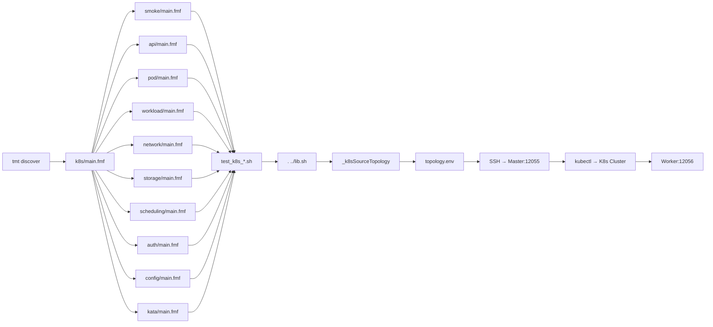

# Design Document: K8s RISC-V 适配 Sonobuoy 等价测试用例开发

> **状态**: Implemented ✅ | **创建时间**: 2026-07-23 | **作者**: AI (honghua) | **关联需求**: requirement-1
> **自测报告**: [self-test-report.md](./self-test-report.md) — 25/25 100% 通过（2026-07-24）

---

## 1. 设计概述

### 1.1 设计目标

将 Sonobuoy 覆盖的 K8s 测试领域拆分为 25 个基于 tmt + beakerlib 的测试用例，每个用例遵循单一职责原则，覆盖 Smoke / API / Pod / Workload / Network / Storage / Scheduling / Auth-Config / Kata 九大领域。

### 1.2 设计范围

| 范围 | 说明 |
|------|------|
| **新增** | 25 个测试脚本 (`test_k8s_*.sh`) + 更新 `main.fmf` |
| **修改** | `lib.sh` — 增强共享函数库 |
| **删除** | 现有 8 个草稿脚本（全部重构） |
| **不变** | `topology.env.example`、`tools/cloudpods/create_k8s_env.py` |

---

## 2. 技术方案

### 2.1 方案选型

| 方案 | 优点 | 缺点 | 结论 |
|------|------|------|------|
| **A. 直接运行 Sonobuoy 二进制** | 官方背书、零开发 | RISC-V 需定制版、不可拆分、SOP 已说明非官方 conformance | ❌ 不采用 |
| **B. tmt + beakerlib 等价脚本（本次采用）** | 可拆分、可独立运行、与项目框架一致、可覆盖 Sonobuoy 未覆盖的领域 | 需自行编写、与 Sonobuoy 输出不完全对齐 | ✅ 采用 |

### 2.2 方案描述

- **框架**: tmt (Test Management Tool) + FMF (Flexible Metadata Format) + beakerlib
- **语言**: Bash (所有测试脚本)
- **连接**: SSH + sshpass → RISC-V QEMU VM → kubectl
- **复用**: `lib.sh` 提供所有共享函数（连接、kubectl 封装、资源操作）
- **隔离**: 每个测试用例使用独立命名空间 `k8s-feature-test-<name>`，测试后清理

---

## 3. 详细设计

### 3.1 目录结构

```
tests/feature/k8s/
├── main.fmf                              # 25 个测试条目 + 元数据（test 路径指向子目录）
├── lib.sh                                # 增强版共享函数库
├── topology.env.example                  # 不变
│
├── smoke/                                # P0 - 冒烟验证（4 个）
│   ├── main.fmf                          # smoke 组元数据
│   ├── test_k8s_smoke_arch_check.sh      # 节点架构验证
│   ├── test_k8s_smoke_dns_resolve.sh     # DNS 解析验证
│   ├── test_k8s_smoke_api_reachable.sh   # API Server 可达性
│   └── test_k8s_smoke_daemonset.sh       # DaemonSet 集成验证（等效 Sonobuoy smoke 插件）
│
├── api/                                  # P1 - API 与资源管理（2 个）
│   ├── main.fmf
│   ├── test_k8s_api_resource_crud.sh     # 资源 CRUD 操作
│   └── test_k8s_api_namespace_lifecycle.sh # Namespace 生命周期
│
├── pod/                                  # P1 - Pod 生命周期（2 个）
│   ├── main.fmf
│   ├── test_k8s_pod_basic_lifecycle.sh   # Pod 基本生命周期
│   └── test_k8s_pod_multi_container.sh   # 多容器 Pod
│
├── workload/                             # P1 - 工作负载管理（2 个）
│   ├── main.fmf
│   ├── test_k8s_workload_deployment.sh   # Deployment 扩缩容/滚动更新
│   └── test_k8s_workload_replicaset.sh   # ReplicaSet 副本维护
│
├── network/                              # P1 - 网络通信（4 个）
│   ├── main.fmf
│   ├── test_k8s_network_service_clusterip.sh # ClusterIP Service
│   ├── test_k8s_network_service_nodeport.sh  # NodePort Service
│   ├── test_k8s_network_dns.sh               # CoreDNS 解析
│   └── test_k8s_network_cross_node_pod.sh    # 跨节点 Pod 通信
│
├── storage/                              # P1 - 存储卷（3 个）
│   ├── main.fmf
│   ├── test_k8s_storage_pvc_binding.sh       # PVC/PV 绑定
│   ├── test_k8s_storage_volume_mount.sh      # 卷挂载读写
│   └── test_k8s_storage_data_persistence.sh  # 数据持久化
│
├── scheduling/                           # P2 - 调度策略（4 个）
│   ├── main.fmf
│   ├── test_k8s_scheduling_nodeselector.sh   # NodeSelector
│   ├── test_k8s_scheduling_affinity.sh       # Pod 亲和性/反亲和性
│   ├── test_k8s_scheduling_taints_tolerations.sh # Taint/Toleration
│   └── test_k8s_scheduling_resource_quota.sh # ResourceQuota
│
├── auth/                                 # P2 - 认证授权（1 个）
│   ├── main.fmf
│   └── test_k8s_auth_serviceaccount.sh       # ServiceAccount
│
├── config/                               # P2 - 配置管理（2 个）
│   ├── main.fmf
│   ├── test_k8s_config_secret.sh             # Secret
│   └── test_k8s_config_configmap.sh          # ConfigMap
│
└── kata/                                 # P2 - Kata 容器（1 个）
    ├── main.fmf
    └── test_k8s_kata_runtime_basic.sh    # Kata 容器运行时（不支持则 SKIP）
```

### 3.2 lib.sh 接口设计

> **路径说明**: `lib.sh` 位于 `tests/feature/k8s/lib.sh`，子目录中的脚本引用方式为 `. "$(dirname "$0")/../lib.sh"`。

#### 3.2.1 保留的现有函数

```bash
# Suite 生命周期（引用计数，保证只初始化一次）
k8sSetup()                              # 初始化 K8s 连接，注册 k8sCleanup
k8sCleanup()                            # 引用计数递减，最后一个测试清理

# 基本操作
k8sKubectl(args...)                     # 在 Master 节点执行 kubectl（自动 sudo）
_k8sMasterSSH(cmd)                      # SSH 到 Master 执行命令
_k8sSourceTopology()                    # 加载 topology.env

# 健康检查
k8sClusterHealthCheck()                 # 检查节点 Ready + kube-system Pods Running
```

#### 3.2.2 新增函数

```bash
# === YAML/资源操作 ===
# 从 stdin 或文件 apply YAML，返回 kubectl 输出
k8sApplyYAML(yaml_content_or_file)

# 等待指定 label 的 Pod 达到 Ready 状态
# 参数: namespace, label_selector, timeout_seconds
k8sWaitForPodReady(ns, label, timeout)

# 获取指定 label 的第一个 Pod 名称
# 参数: namespace, label_selector → stdout: pod_name
k8sGetPodName(ns, label)

# 在 Pod 中执行命令
# 参数: namespace, pod_name, command
k8sExecInPod(ns, pod, cmd)

# 删除资源（安全删除，忽略不存在）
# 参数: resource_type, resource_name, namespace(可选)
k8sDeleteResource(type, name, ns)

# === 环境检查 ===
# 检查指定镜像是否在 containerd 中可用
# 参数: image_name → 0=存在, 1=不存在
k8sImageExists(image)

# 获取集群节点数量
k8sGetNodeCount()                       # → stdout: count

# === Kata 运行时 ===
# 检查 kata-clh RuntimeClass 是否存在
k8sKataRuntimeAvailable()               # → 0=可用, 1=不可用
```

### 3.3 FMF 元数据设计

#### 3.3.1 main.fmf 结构

顶层 `tests/feature/k8s/main.fmf` 使用 `discover` 聚合各子目录：

```yaml
summary: K8s RISC-V feature verification — Sonobuoy-equivalent test suite
tag:
  - feature
  - k8s
  - riscv
  - sonobuoy-equivalent
duration: 2h
tier: 1

/k8s-smoke:
  summary: K8s smoke tests — arch check, DNS, API reachability, DaemonSet
  discover:
    how: fmf
    path: smoke/

/k8s-api:
  summary: K8s API tests — resource CRUD, namespace lifecycle
  discover:
    how: fmf
    path: api/

# ... (其余子目录同理，共 10 个 discover 条目)
```

各子目录 `main.fmf` 示例 (`smoke/main.fmf`)：

```yaml
summary: K8s smoke verification - cluster health and basic connectivity
tag:
 - feature
 - k8s
 - riscv
 - smoke
duration: 15m
tier: 1

/test_k8s_smoke_arch_check:
  summary: Verify all cluster nodes report riscv64 architecture
  test: ./test_k8s_smoke_arch_check.sh
  tag:
   - feature
   - k8s
   - riscv
   - smoke
  duration: 2m
  tier: 1

/test_k8s_smoke_dns_resolve:
  summary: Verify DNS resolution of kubernetes.default.svc.cluster.local from pod
  test: ./test_k8s_smoke_dns_resolve.sh
  tag:
   - feature
   - k8s
   - riscv
   - smoke
  duration: 3m
  tier: 1

# ... (其余类似)
```

#### 3.3.2 标签体系

| 标签 | 含义 | 涉及用例 |
|------|------|----------|
| `smoke` | 快速冒烟验证 | 4 个 smoke 用例 |
| `api` | API/资源操作 | 2 个 API 用例 |
| `pod` | Pod 生命周期 | 2 个 Pod 用例 |
| `workload` | 工作负载管理 | 2 个 Workload 用例 |
| `network` | 网络通信 | 4 个 Network 用例 |
| `storage` | 存储卷 | 3 个 Storage 用例 |
| `scheduling` | 调度策略 | 4 个 Scheduling 用例 |
| `auth` | 认证授权 | 1 个 Auth 用例 |
| `config` | 配置管理 | 2 个 Config 用例 |
| `kata` | Kata 容器 | 1 个 Kata 用例 |
| `riscv` | RISC-V 架构 | 全部 25 个用例 |

### 3.4 数据流



### 3.5 错误处理策略

| 场景 | 处理方式 |
|------|----------|
| SSH 连接失败 | `rlFail` + 退出，标记为环境问题 |
| kubectl 命令失败 | `rlRun` 捕获退出码，非 0 则 `rlFail` |
| Pod 未在超时内 Ready | `rlFail` + 输出 `kubectl describe pod` 诊断信息 |
| 镜像不存在 | `k8sImageExists` 检查 → `rlSkip` 跳过 |
| Kata RuntimeClass 不存在 | `rlSkip "Kata containers not supported on this cluster"` |
| 资源已存在（apply 冲突） | 先 `kubectl delete --ignore-not-found` 再创建 |
| 跨节点测试 Worker 不可用 | `k8sGetNodeCount` < 2 → `rlSkip` |

### 3.6 命名空间规范

每个测试用例使用独立命名空间，避免冲突：

| 用例 | 命名空间 |
|------|----------|
| smoke_arch_check | 无需（kubectl get nodes 即可） |
| smoke_dns_resolve | `k8s-feature-test-smoke-dns` |
| smoke_api_reachable | `k8s-feature-test-smoke-api` |
| smoke_daemonset | `k8s-feature-test-smoke-ds` |
| api_resource_crud | `k8s-feature-test-api-crud` |
| api_namespace_lifecycle | `k8s-feature-test-api-ns` |
| pod_basic_lifecycle | `k8s-feature-test-pod-life` |
| pod_multi_container | `k8s-feature-test-pod-multi` |
| workload_deployment | `k8s-feature-test-wl-deploy` |
| workload_replicaset | `k8s-feature-test-wl-rs` |
| network_service_clusterip | `k8s-feature-test-net-cip` |
| network_service_nodeport | `k8s-feature-test-net-np` |
| network_dns | `k8s-feature-test-net-dns` |
| network_cross_node_pod | `k8s-feature-test-net-xnode` |
| storage_pvc_binding | `k8s-feature-test-sto-pvc` |
| storage_volume_mount | `k8s-feature-test-sto-vol` |
| storage_data_persistence | `k8s-feature-test-sto-persist` |
| scheduling_nodeselector | `k8s-feature-test-sched-ns` |
| scheduling_affinity | `k8s-feature-test-sched-aff` |
| scheduling_taints_tolerations | `k8s-feature-test-sched-taint` |
|| scheduling_resource_quota | `k8s-feature-test-sched-quota` |
|| auth_serviceaccount | `k8s-feature-test-auth-sa` |
|| config_secret | `k8s-feature-test-cfg-sec` |
| config_configmap | `k8s-feature-test-cfg-cm` |
| kata_runtime_basic | `k8s-feature-test-kata` |

---

## 4. 文件变更清单

| 文件路径 | 操作 | 说明 |
|----------|------|------|
| `tests/feature/k8s/main.fmf` | **重写** | 顶层聚合，10 个 `discover` 条目指向子目录 |
| `tests/feature/k8s/lib.sh` | **增强** | 新增 8 个共享函数，子目录脚本用 `../lib.sh` 引用 |
| `tests/feature/k8s/smoke/main.fmf` | **新增** | Smoke 组元数据 |
| `tests/feature/k8s/smoke/test_k8s_smoke_arch_check.sh` | **新增** | |
| `tests/feature/k8s/smoke/test_k8s_smoke_dns_resolve.sh` | **新增** | |
| `tests/feature/k8s/smoke/test_k8s_smoke_api_reachable.sh` | **新增** | |
| `tests/feature/k8s/smoke/test_k8s_smoke_daemonset.sh` | **新增** | 替代 sonobuoy_smoke |
| `tests/feature/k8s/api/main.fmf` | **新增** | |
| `tests/feature/k8s/api/test_k8s_api_resource_crud.sh` | **新增** | |
| `tests/feature/k8s/api/test_k8s_api_namespace_lifecycle.sh` | **新增** | |
| `tests/feature/k8s/pod/main.fmf` | **新增** | |
| `tests/feature/k8s/pod/test_k8s_pod_basic_lifecycle.sh` | **新增** | 替代 conformance_pod_lifecycle |
| `tests/feature/k8s/pod/test_k8s_pod_multi_container.sh` | **新增** | |
| `tests/feature/k8s/workload/main.fmf` | **新增** | |
| `tests/feature/k8s/workload/test_k8s_workload_deployment.sh` | **新增** | |
| `tests/feature/k8s/workload/test_k8s_workload_replicaset.sh` | **新增** | |
| `tests/feature/k8s/network/main.fmf` | **新增** | |
| `tests/feature/k8s/network/test_k8s_network_service_clusterip.sh` | **新增** | |
| `tests/feature/k8s/network/test_k8s_network_service_nodeport.sh` | **新增** | |
| `tests/feature/k8s/network/test_k8s_network_dns.sh` | **新增** | |
| `tests/feature/k8s/network/test_k8s_network_cross_node_pod.sh` | **新增** | 替代 network_cross_node |
| `tests/feature/k8s/storage/main.fmf` | **新增** | |
| `tests/feature/k8s/storage/test_k8s_storage_pvc_binding.sh` | **新增** | |
| `tests/feature/k8s/storage/test_k8s_storage_volume_mount.sh` | **新增** | 替代 storage_pvc_lifecycle |
| `tests/feature/k8s/storage/test_k8s_storage_data_persistence.sh` | **新增** | |
| `tests/feature/k8s/scheduling/main.fmf` | **新增** | |
| `tests/feature/k8s/scheduling/test_k8s_scheduling_nodeselector.sh` | **新增** | |
| `tests/feature/k8s/scheduling/test_k8s_scheduling_affinity.sh` | **新增** | 替代 scheduling_pod_affinity |
| `tests/feature/k8s/scheduling/test_k8s_scheduling_taints_tolerations.sh` | **新增** | |
| `tests/feature/k8s/scheduling/test_k8s_scheduling_resource_quota.sh` | **新增** | |
| `tests/feature/k8s/auth/main.fmf` | **新增** | |
| `tests/feature/k8s/auth/test_k8s_auth_serviceaccount.sh` | **新增** | |
| `tests/feature/k8s/config/main.fmf` | **新增** | |
| `tests/feature/k8s/config/test_k8s_config_secret.sh` | **新增** | 替代 workload_config |
| `tests/feature/k8s/config/test_k8s_config_configmap.sh` | **新增** | |
| `tests/feature/k8s/kata/main.fmf` | **新增** | |
| `tests/feature/k8s/kata/test_k8s_kata_runtime_basic.sh` | **新增** | 替代 kata_containers |
| `tests/feature/k8s/test_k8s_quick_health_check.sh` | **删除** | 合并到 smoke 用例 |
| `tests/feature/k8s/test_k8s_conformance_pod_lifecycle.sh` | **删除** | 重构为 pod_basic_lifecycle |
| `tests/feature/k8s/test_k8s_network_cross_node_communication.sh` | **删除** | 重构为 network_cross_node_pod |
| `tests/feature/k8s/test_k8s_storage_pvc_lifecycle.sh` | **删除** | 重构为 storage_volume_mount |
| `tests/feature/k8s/test_k8s_scheduling_pod_affinity.sh` | **删除** | 重构为 scheduling_affinity |
| `tests/feature/k8s/test_k8s_workload_config_primitives.sh` | **删除** | 重构为 config_secret + config_configmap |
| `tests/feature/k8s/test_k8s_sonobuoy_smoke.sh` | **删除** | 重构为 4 个 smoke 用例 |
| `tests/feature/k8s/test_k8s_kata_containers_runtime.sh` | **删除** | 重构为 kata_runtime_basic |

---

## 5. 测试计划

### 5.1 当前状态

- **实现完成**: 25 个测试脚本 + 11 个 main.fmf + 1 个 lib.sh（2026-07-24）
- **自测完成**: 25/25 100% 通过（2026-07-24），详见 [self-test-report.md](./self-test-report.md)

### 5.2 执行顺序

按优先级分组执行：

```
1. Smoke (4)    → 2m+3m+3m+5m = 13m    [P0 - 必须全过]
2. API (2)      → 10m+5m = 15m         [P1]
3. Pod (2)      → 8m+8m = 16m          [P1]
4. Workload (2) → 10m+5m = 15m         [P1]
5. Network (4)  → 8m+5m+5m+8m = 26m    [P1]
6. Storage (3)  → 8m+8m+5m = 21m       [P1]
7. Scheduling (4)→ 5m+8m+5m+5m = 23m   [P2]
8. Auth/Config(3)→ 5m+8m+8m = 21m      [P2]
9. Kata (1)     → 10m                   [P2, 可能 SKIP]
─────────────────────────────────────
Total: ~160m (~2.7h)
```

### 5.2 执行命令

```bash
# 按分组执行
tmt run -a smoke     test --name /test_k8s_smoke
tmt run -a api       test --name /test_k8s_api
tmt run -a network   test --name /test_k8s_network
# ...

# 全量执行
tmt run -a feature test --name /test_k8s
```

### 5.3 验收方式

- [x] 每个用例在 12055/12056 环境上单独运行通过
- [x] 4 个 Smoke 用例全部 PASS
- [x] Kata 用例：支持则 PASS，不支持则 SKIP（实际 PASS）
- [x] 脚本问题已修复（4 个脚本修复，详见自测报告）
- [x] 环境问题已修复（CoreDNS loop）

> 详细自测结果见 [self-test-report.md](./self-test-report.md)

---

## 6. 实施计划

### 6.1 实施顺序

| 步骤 | 内容 | 产出 | 状态 |
|------|------|------|------|
| 1 | 增强 `lib.sh` | 新增 8 个函数 | ✅ 完成 |
| 2 | 删除旧文件 + 创建子目录 + 各子目录 `main.fmf` | 10 个子目录 + 10 个 main.fmf | ✅ 完成 |
| 3 | 实现 Smoke 组 (4 个) | P0 脚本 | ✅ 完成 |
| 4 | 实现 API + Pod + Workload 组 (6 个) | P1 脚本 | ✅ 完成 |
| 5 | 实现 Network + Storage 组 (7 个) | P1 脚本 | ✅ 完成 |
| 6 | 实现 Scheduling + Auth/Config + Kata 组 (8 个) | P2 脚本 | ✅ 完成 |
| 7 | 远程环境调试 | 所有脚本 PASS/SKIP | ✅ 完成（25/25 100%） |

### 6.2 风险与缓解

| 风险 | 缓解 |
|------|------|
| RISC-V busybox 镜像不可用 | 使用 `k8sImageExists` 预检，无镜像则 SKIP |
| 单节点集群（Worker 未就绪） | `k8sGetNodeCount` < 2 时跨节点测试 SKIP |
| Kata 不支持 | `k8sKataRuntimeAvailable` 检查 → SKIP |
| QEMU 性能波动导致超时 | 超时设置留有余量（通常 1.5x-2x 正常耗时） |

---

## 7. 附录

### 7.1 新旧文件映射

| 旧文件 | 新文件 | 变更说明 |
|--------|--------|----------|
| `test_k8s_quick_health_check.sh` | `smoke/test_k8s_smoke_arch_check.sh` + `smoke/test_k8s_smoke_dns_resolve.sh` + `smoke/test_k8s_smoke_api_reachable.sh` | 拆分为 3 个原子验证 |
| `test_k8s_sonobuoy_smoke.sh` | `smoke/test_k8s_smoke_daemonset.sh` | 简化 + 对齐飞书 SOP |
| `test_k8s_conformance_pod_lifecycle.sh` | `pod/test_k8s_pod_basic_lifecycle.sh` | 聚焦 Pod 生命周期核心路径 |
| `test_k8s_network_cross_node_communication.sh` | `network/test_k8s_network_cross_node_pod.sh` | 命名规范化 |
| `test_k8s_storage_pvc_lifecycle.sh` | `storage/test_k8s_storage_volume_mount.sh` | 聚焦卷挂载（PVC 绑定拆分到新文件） |
| `test_k8s_scheduling_pod_affinity.sh` | `scheduling/test_k8s_scheduling_affinity.sh` | 命名规范化 |
| `test_k8s_workload_config_primitives.sh` | `config/test_k8s_config_secret.sh` + `config/test_k8s_config_configmap.sh` | 一拆为二 |
| `test_k8s_kata_containers_runtime.sh` | `kata/test_k8s_kata_runtime_basic.sh` | 命名规范化 + 增加 SKIP 逻辑 |

### 7.2 参考

- 飞书 SOP: [openRuyi RISC-V QEMU 多节点 Kubernetes Nexus SOP](https://openruyi.feishu.cn/wiki/SWvdwvwOfizoQOkNZX5c4KRqn9b)
- `.trellis/spec/script-dev/` — Shell/Python/FMF 规范
- `.trellis/spec/guides/development-workflow.md` — 开发流程
